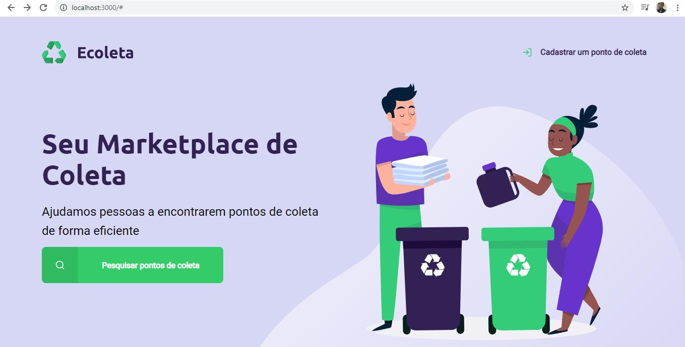

# Projeto Ecoleta

Um sistema para visualização e cadastro de pontos de coleta e reciclagem. Projeto construido pela [Rocketseat](https://rocketseat.com.br/) na _Next Level Week_.

## Tecnologias

- JavaScript
- Nodejs
- Sqlite3/SQL

## Comandos

- `npm install` instalar as dependências do Node.
- `npm start` iniciar o servidor.
   

